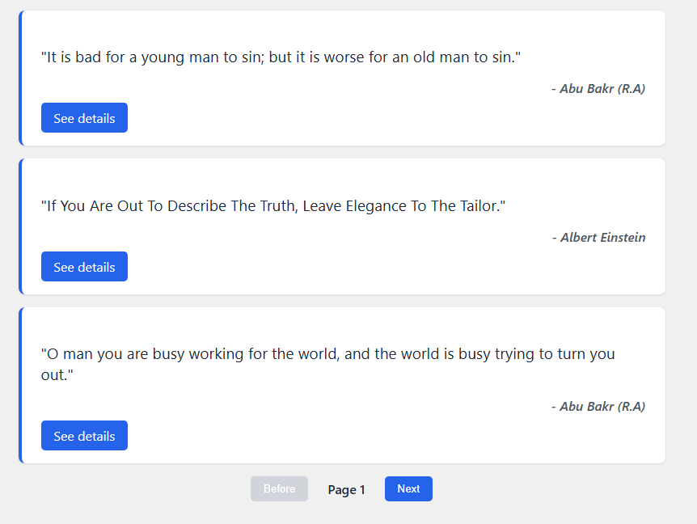

# Quote Management System - Technical Assessment

This project is a high-performance Quote Management System built as a Laravel Package. It features a Vue 3 SPA, Binary Search lookup logic, and a fully automated Dockerized deployment.

---

##  Features

* **PHP 8.4 & Laravel 11** core.
* **Vue 3 + TypeScript** SPA with Vite.
* **Binary Search Algorithm**: Optimized $O(\log n)$ lookup for quote IDs.
* **IP-Based Rate Limiting**: Security strategy to prevent abuse without affecting multiple users.
* **Automated Docker Pipeline**: Self-installing environment with integrated Node.js build process.

---

##  Docker Environment Instructions

 The Docker container handles Laravel installation, package linking, and frontend compilation automatically.

### 1. Prerequisites
* Docker and Docker Compose installed.
* Port `8080` must be available.
* Create a `.env` file based on the `.env.example` file.

### 2. Execution
From the project root, run:
```bash
docker-compose up --build
```

---

##  Testing
From another terminal the project root and the new Laravel app up and running, run:
```bash
docker-compose exec app ./package/vendor/bin/pest -c package/phpunit.xml
```
If you have some issues using linux try:
```bash
sudo docker-compose exec app chmod +x ./package/vendor/bin/pest && sudo docker-compose exec app ./package/vendor/bin/pest -c package/phpunit.xml
```
##  Rate Limiting strategy
We generate a unique signature for every request based on the Client's IP Address. The logic utilizes Laravel's RateLimiter facade to manage atomic counters in the cache driver.

### Traffic Flow
* Incoming Request: The system identifies the IP.

* Check Cache: It retrieves the current hit count for that specific IP key.

* Decision:

1. Under Limit: The counter is incremented, and the request proceeds to the Binary Search logic.

2. Over Limit: A RateLimitExceededException is thrown immediately.

* Response: The API returns a 429 Too Many Requests status code with a standard Retry-After header, informing the client when they can try again.

## UI View
